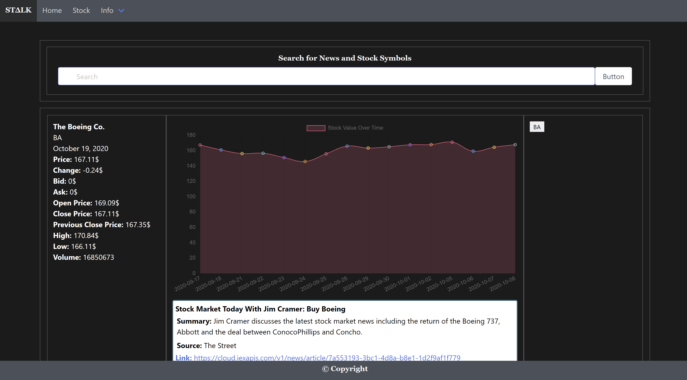
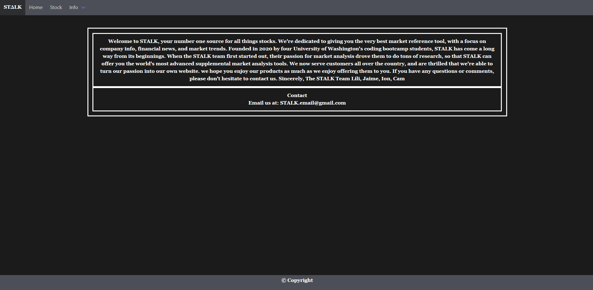

## Project-1"Stock App"
### App name: "STALK"

### Description of project
An innovative app that allows users to keep track of current stocks and news. Search for individual stock info and news.

### User Story:
As someone with an interest in the economic state we find ourselves, I want an app that will allow me to research companies of my interest
in an effective way. I would like to have access to the companies stock history, current value, and most recent news articles that will affect the company itself.
### Images with application functionality:

| Main page    | Stock page | About page|
|------------|------------|------------|
|  |  ||

### Tech/framework used:
* Figma (Wireframe)
* Bulma (CSS Framework)
* Chart.JS (Javascript)
* APIs Used:
- Yahoo Finance 
- Cloud.iexapis.com

### Usage:
The Home page contains top stock news and a navbar directing the user to either the Stock page or the About Us page.

In the stock page, you'll find a search bar where the user can type in a company's symbol and retrieve all current information and news articles. The user will also be shown a graph of the past 14 days and present with the stocks value over time. 

### Credits:
* https://bulma.io/ - CSS Framework
* https://rapidapi.com/marketplace - news API Key (https://finance.yahoo.com/)
* https://rapidapi.com/marketplace - stock API key (Cloud.iexapis.com)

### Directory:
* GitHub Link: https://github.com/lillianhuynh/STALK.git
* App Link: https://lillianhuynh.github.io/STALK/

### Contributing:
* Name: Lilian Huynh
- Email: lillianhuynh312@gmail.com
- Github profile: https://github.com/lillianhuynh
* Name: Jaimie Valle
- Email:jsvalle1229@gmail.com
- Github profile:https://github.com/jsvalle123 
* Name: Cameron Hickey
- Email: camslens@gmail.com
- Github profile:https://github.com/Chickey49
* Name: Ion Gavrilita
- Email: gavrilita.ion.93@gmail.com
- Github profile: https://github.com/IonGavrilita

